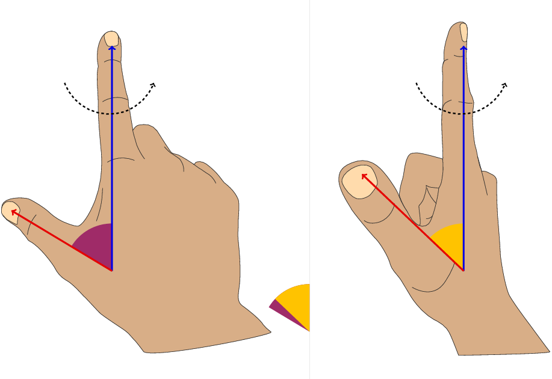

# Experimentally verifying Rotating Vector Model

[Rotating Vector Model(RVM)](https://ui.adsabs.harvard.edu/abs/1969ApL.....3..225R/abstract) is popular in pulsar astronomy [Johnston+24](https://ui.adsabs.harvard.edu/abs/2024MNRAS.530.4839J/abstract).

But RVM is universal than that.
Even our hand shows this, when we track the apparent angle between the thumb and index finger.

### This repository

is the collection of scripts, intermediates and results of the aligned rotator and inclined rotator experiments.
The repository is released with a paper that will _hopefully_ be submitted on arxiv.

The following two videos show the data collected:

#### Aligned rotator
<video>
<source src="aligned_rotator.mp4" type="video/mp4">
</video>

#### Inclined rotator
<video>
<source src="inclined_rotator.mp4" type="video/mp4">
</video>

### Quick outcomes

1. This work is unable show the RVM-like variability. It could be due to its own limitation, or that the design of this experiment is flawed.
2. To overcome the limitation, this would need to be repeated with a polarization camera which would give much more accurate orientation measurements.
3. Even after redesigning this experiment,  a polarization camera would anyway be required to accurately measure orientation.
